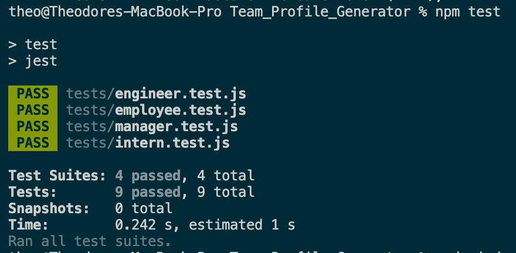
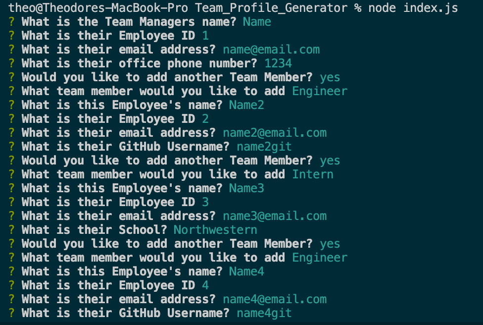
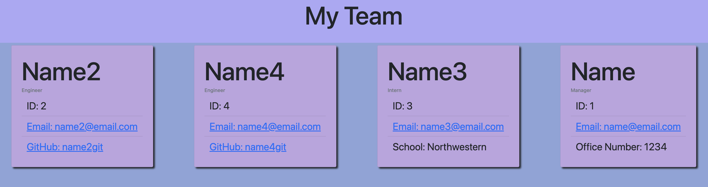

# Team_Profile_Generator
## Description

This project takes user input on the command line to create a team profile. First you add the manager, then are presented with options for adding engineers and interns. Once all team members have been added HTML is dynamically generated that displays all team members and their info.

See a [walkthrough](https://drive.google.com/drive/folders/1GoQ7qP7-PFUgF8gIaupN9SuIe5jBPTJw?usp=sharing)
## Table of Contents

-[Installation](#installation)  
-[Usage](#usage)  
-[Contributing](#contributing)  
-[Tests](#tests)  
-[Questions](#questions)  
-[License](#license)  

## Installation

The following is required to install the program.  
npm i

## Usage
To run, do the following:   
type node index.js in the command line and then follow the prompts.

Usage Images:

Run Tests to check constructors:
 

Answer all the prompts in the Command Line:

HTML is output based on the user answers which can be opened to view this site.
  

## Contributing

please fork

## Tests

To test, run the following  
NPM Test

## Questions

For questions please check [my GitHub](https://github.com/Tward9)
or reach out via email at <theoward9@gmail.com>

## Sample HTML File

[HTML](src/index.html)
